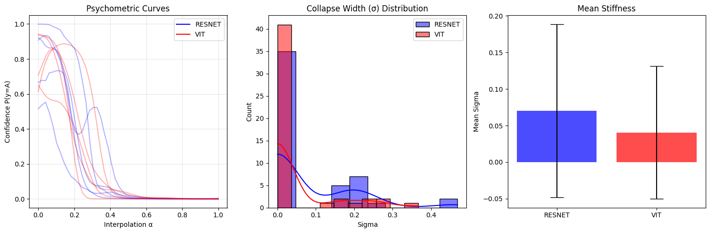

# Collapse Dynamics: Behavioral Stability and Thermodynamics of Neural Inference

## Thesis
This repository inaugurates a post-geometric research program. Neural networks are treated as dynamical, information-dissipating systems whose core property is how decisions **collapse**, not how representations are arranged. 

Key tenets:
- **Inference is a collapse**: The process of computation is a transition from high-entropy input signals to low-entropy categorical decisions.
- **Geometry is non-operative**: Static representation geometry (manifolds, anisotropy) is considered epiphenomenal and does not constrain execution during inference.
- **Behavioral dynamics are primary**: The correct object of interpretability is the stability and "stiffness" of the decision-making process under perturbation.

This research marks a definitive pivot away from geometric interpretability toward a behavioral and thermodynamic framework.

---

## Experiment Roadmap

### Experiment 01 — Psychometric Stress Test (Completed)
Probing the brittleness of decision boundaries under directed interpolation. Initial results compare ResNet18 and ViT architectures under domain shift.

### Experiment 02 — Depth-wise Stability / Lyapunov Scan (Planned)
Measuring the stability of internal representations and decision trajectories across the depth of the network.

### Experiment 03 — Irreversibility Horizon (Planned)
Quantifying the point-of-no-return in the inference process where the transition from representation to classification becomes informationally irreversible.

---

## Results Summary

### Experiment 01 — Psychometric Stress Test

**Summary Results (schematic, not raw training logs)**

*Collapse Width (σ) comparison between ResNet18 and ViT architectures. ViT exhibits significantly narrower σ (≈ 0.04), indicating more brittle decision collapse compared to ResNet (≈ 0.07).*

- **Finding**: ViT decision boundaries are brittle and exhibit "step-function" behavior under perturbation.
- **Interpretation**: Global attention mechanisms lack the local smoothing biases of convolutions, leading to abrupt decision transitions.
- **Traceability**: See [exp01_psychometric.md](docs/results/exp01_psychometric.md) for full analysis.

---

## Repository Structure
- `experimental_design.md`: Formal specifications and contracts for all experiments.
- `docs/background.md`: Brief context on the shift from geometric to behavioral paradigms.
- `docs/results/`: Detailed summaries and data from executed experiments.
- `figures/`: Key visualizations and results charts.
- `notebooks/`: Runnable implementations and diagnostics (localized or Colab-linked).

---

## Conclusion
Static geometry has been falsified as a reliable constraint on network execution. **Collapse Dynamics** provides the tools to measure what the network *does*, rather than how it *looks*.
